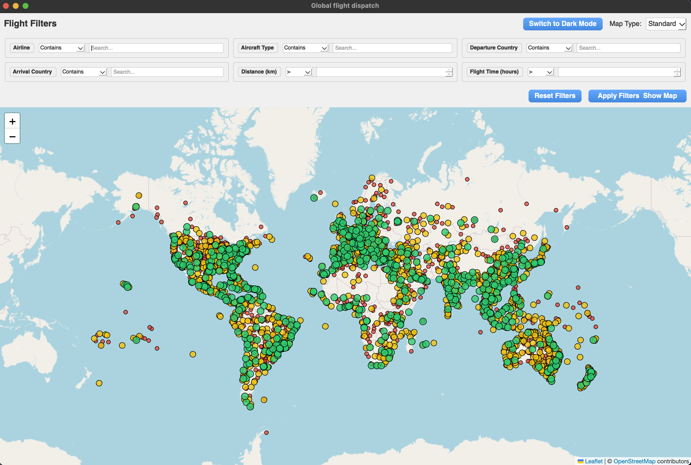

# FSDispatch — Flight Dispatch Map Viewer

A desktop application for visualising live flight data on an interactive world map. Built with Python, PyQt6, and Leaflet.js.

---

## Screenshots

*The program when it is just opened:*



*All flights to or from Heathrow:*


*Detailed Flight Info:*


---

## What Is It?

FSDispatch reads a CSV file containing flight data (e.g. captured from a flight simulator or live flight tracking service) and displays every flight's departure and arrival airport as a coloured dot on an interactive world map.

**Key features:**

- **Instant world map** — all airports from your CSV are shown immediately on launch, no filtering required.
- **Airport colour coding by traffic volume:**
  - 🟢 **Green** — Major / high-frequency airports
  - 🟡 **Yellow** — Medium-frequency airports
  - 🔴 **Red** — Low-frequency / small airports
- **Click-to-explore interaction:**
  - Click an airport to load all flights connected to it (departures *and* arrivals).
  - Click a second connected airport to drill down and see only the flights between those two airports.
  - Click the source airport again to return to all connections.
  - Click anywhere on the map to deselect.
- **Detailed flight cards** — for any airport pair, each flight is displayed as a card showing:
  - Flight Number
  - Airline
  - Callsign
  - Aircraft Registration
  - Aircraft Type (full name) & ICAO type code
  - Departure & Arrival IATA codes
  - Departure & Arrival ICAO codes
- **Filters** — narrow the data shown on the map by any combination of filter criteria.
- **Multiple map tile styles** — Standard (OpenStreetMap), Satellite (Esri), and Hybrid (Google).
- **Dark / Light mode** toggle.
- **Performance-first design** — only airport locations are loaded into the map on initial render. Flight route data is fetched on demand when you click an airport, so the map remains responsive even with tens of thousands of flights in the dataset.

---

## Requirements

- Python 3.10+
- The packages listed in `requirements.txt`

---

## Installation & Running

### 1. Clone the repository

```bash
git clone https://github.com/Leofric99/fsdispatch.git
cd fsdispatch
```

### 2. Install dependencies

```bash
pip install -r requirements.txt
```

> It is recommended to use a virtual environment:
> ```bash
> python3 -m venv .venv
> source .venv/bin/activate      # macOS / Linux
> .venv\Scripts\activate         # Windows
> pip install -r requirements.txt
> ```

### 3. Add your flight data

Place your flight CSV file at:

```
run/database/flights.csv
```

The CSV must contain the following columns (all used by the application):

| Column | Description |
|--------|-------------|
| `owner` | Airline name |
| `reg` | Aircraft registration |
| `type` | Full aircraft type name |
| `type_icao` | ICAO aircraft type code |
| `flight_number` | Flight number |
| `calsign` | Callsign |
| `dep_airport` | Departure airport full name |
| `dep_airport_iata` | Departure IATA code |
| `dep_airport_icao` | Departure ICAO code |
| `dep_airport_city` | Departure city |
| `dep_airport_country` | Departure country |
| `dep_airport_lat` | Departure latitude |
| `dep_airport_lon` | Departure longitude |
| `arr_airport` | Arrival airport full name |
| `arr_airport_iata` | Arrival IATA code |
| `arr_airport_icao` | Arrival ICAO code |
| `arr_airport_city` | Arrival city |
| `arr_airport_country` | Arrival country |
| `arr_airport_lat` | Arrival latitude |
| `arr_airport_lon` | Arrival longitude |
| `distance` | Route distance (km) |
| `rough_flight_time` | Approximate flight time (hours) |
| `timestamp_read` | When the record was captured |

### 4. Run the application

```bash
python3 -m run
```

---

## Filtering

The filter bar at the top of the window lets you narrow the data shown on the map. Filters can be applied on their own or combined.

| Filter | Type | Description |
|--------|------|-------------|
| **Airline** | Text (contains / equals / starts with / ends with) | Filter by airline operator name |
| **Aircraft Type** | Text | Filter by aircraft type, e.g. `A320`, `B737` |
| **Departure Country** | Dropdown (multi-select) | Show only flights departing from selected countries |
| **Arrival Country** | Dropdown (multi-select) | Show only flights arriving into selected countries |
| **Distance (km)** | Numeric (`>`, `<`, `=`, `>=`, `<=`) | Filter by route distance |
| **Flight Time (hours)** | Numeric | Filter by approximate flight duration |

Click **Apply Filters & Show Map** to update the map. Click **Reset Filters** to return to the full unfiltered dataset.

---

## Project Structure

```
fsdispatch/
├── run/
│   ├── __init__.py
│   ├── __main__.py          # Entry point
│   ├── gui.py               # Main window, filter UI, Python↔JS bridge
│   ├── mapping.py           # HTML/Leaflet.js map generation
│   ├── filtering.py         # Pandas filter logic
│   ├── data_loader.py       # CSV loading
│   ├── config.py            # Themes, tile providers, column names
│   └── database/
│       └── flights.csv      # Your flight data goes here
├── screenshots/             # Screenshots for the README
├── requirements.txt
└── README.md
```

---

## Dependencies

| Package | Purpose |
|---------|---------|
| `PyQt6` | Desktop GUI framework |
| `PyQt6-WebEngine` | Embedded browser for the Leaflet map |
| `pandas` | CSV loading and data filtering |
| `folium` | Map utility (retained as dependency) |
| `jinja2` | Templating (transitive dependency) |

---

## Licence

This project is provided as-is for personal and educational use. No warranty is given.
