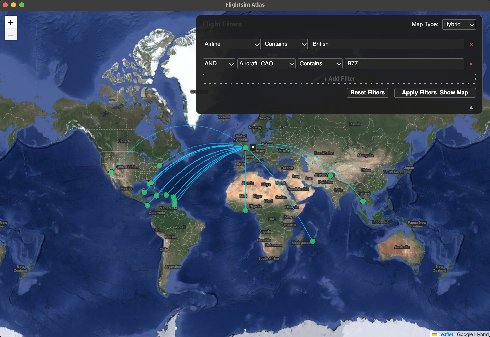

# Flightsim Atlas

A desktop application for visualising real-world flight data inspired by flightconnections.

---

## Screenshots

*Program on first launch* — The application window with an empty map and filter controls at the top.


*Browsing flights* — Click an airport to load all connected flights. Here, all departures and arrivals at Shannon are displayed.


*Detailed flight information* — Each flight is shown as a card with full details including airline, aircraft type, callsign, and airport codes.


*Filtering in action* — Use the filter bar to narrow results by airline, aircraft type, country, distance, and flight time.



---

## What Is It?

Flightsim Atlas visualises flight data on an interactive world map. It reads a CSV file (using data from live tracking services) and displays each flight's departure and arrival airports as colour-coded dots.

**Key features:**

- **Instant world map** — all airports displayed on launch
- **Colour-coded airports** — green (major), yellow (medium), red (small)
- **Click-to-explore** — click airports to filter flights, click again to drill down or deselect
- **Detailed flight cards** — airline, aircraft type, callsigns, airport codes, and more
- **Flexible filtering** — narrow by airline, aircraft type, country, distance, and flight time
- **Multiple map styles** — OpenStreetMap, Satellite (Esri), and Hybrid (Google)
- **Performance-optimised** — airports load on startup; flight data fetches on demand

---

## Installation & Running - Windows

1. Download the ZIP file from the releases tab.
2. Extract the folder within to a siutable location.
3. Run FSAtlas.exe from within the extracted folder.

## Installation & Running - CLI Based

### 1. Clone the repository

```bash
git clone https://github.com/Leofric99/fsdispatch.git
cd fsdispatch
```

### 2. Install dependencies

```bash
pip install -r requirements.txt
```

> It is recommended to use a virtual environment:
> ```bash
> python3 -m venv .venv
> source .venv/bin/activate
> pip install -r requirements.txt
> ```

### 4. Run the application

```bash
python3 -m run
```

> **Disclaimer:** This project was developed with the assistance of [GitHub Copilot](https://github.com/features/copilot). I am not a front-end developer, so there may well be bugs, rough edges, or unconventional code patterns. Contributions and bug reports are welcome!
