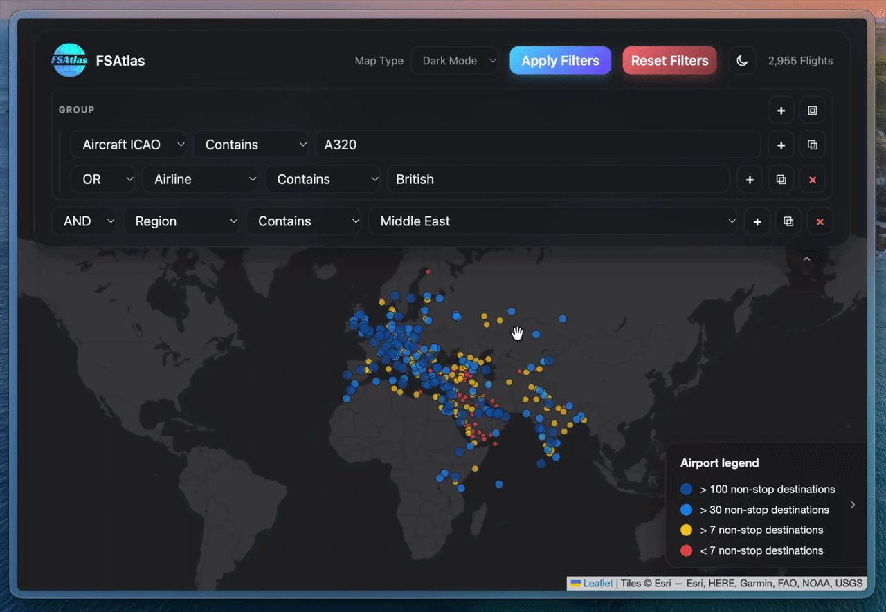
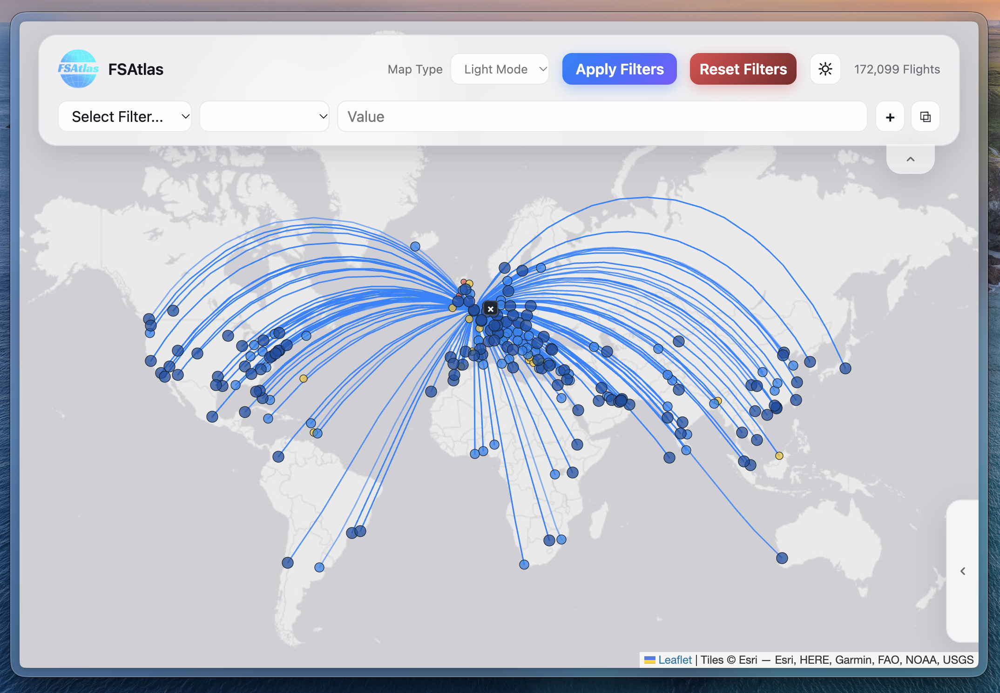

# FSAtlas

[](https://github.com/Leofric99/fsatlas/releases)
[](https://github.com/Leofric99/fsatlas)

<p align="center">
  
</p>

<p align="center">
  <a href="#quick-start">Quick Start</a> &nbsp;|&nbsp;
  <a href="#key-features">Features</a> &nbsp;|&nbsp;
  <a href="https://github.com/Leofric99/fsatlas/releases">Releases</a> &nbsp;|&nbsp;
  <a href="https://github.com/Leofric99/fsatlas">Source Code</a>
</p>

<h3 align="center">FSAtlas allows you to find inspiration for your next flight. Inspired by FlightConnections.</h3>

<p align="center">
  
</p>

## What Is FSAtlas?

FSAtlas reads over 170,000 real-world flight records built from live tracking data and renders every departure and arrival airport as a colour-coded dot on an interactive map just like [FlightConnections](https://www.flightconnections.com), but free, and self-hosted.

Click an airport to explore its connections, select a destination to inspect the details of a route, and open an individual flight to view its specific details.

> FSAtlas is designed for finding inspiration for your next flight. It displays routes as an A - B. It is not designed to display routes as waypoints flows, SIDs, STARs, etc. [Simbrief](https://www.simbrief.com) is recommended for this.

## Key Features

### Explore the network

The full dataset is plotted as soon as the app opens. Airports are rendered as colour-coded points, with the colour and scale of each point reflecting how many non-stop destinations it serves. This makes busy hubs easy to spot while keeping the map readable.

### Inspect flight details

Route results show the individual flights connecting the selected airports. Each flight includes the airline, aircraft type, registration, callsign, airport codes, and date when that information is available.

<p align="center">
  
</p>

### Build flexible filters

Build filter chains across the entire dataset, including airlines, aircraft types, countries, regions, distances, flight times, and more. Filters can be combined with AND/OR logic, and grouped together for granular control over the filtering logic.

<p align="center">
  
</p>

### Choose how to view the map

Choose between Dark Mode, Light Mode, Standard OpenStreetMap, Satellite, and Hybrid map styles. The light and dark themes alter the map, controls, legend, and surrounding UI, and your preference is remembered for the next visit.

<p align="center">
  
</p>


### Keep the interface focused

Hide the filter list or airport legend when you need more room for the map. Both panels collapse into compact pull-tabs and can be restored without losing the current view or filters.

> Airports are rendered on canvas, routes are calculated only when requested, and filtered map views are cached server-side per session. This keeps the initial map responsive while avoiding unnecessary repeated work.


## Quick Start

Choose the setup that best fits your environment.

### Windows

Download the standalone `.exe` from the [FSAtlas v2.1.1 release](https://github.com/Leofric99/fsatlas/releases/tag/v2.1.1).

Once it has downloaded, run the `.exe` and enjoy exploring with FSAtlas.

### Linux & MacOS

The `uv` installation is the quickest way to run FSAtlas locally for MacOS and Linux.

#### Prerequisites

[**UV**](https://docs.astral.sh/uv/getting-started/installation/) — manages the isolated environment and makes the `fsatlas` command available on your `PATH`.

```bash
curl -LsSf https://astral.sh/uv/install.sh | sh
```

#### Installation

Install the latest version directly from the repository:

```bash
uv tool install git+https://github.com/Leofric99/fsatlas.git
```

Then run it:

```bash
fsatlas
```

This starts a local web server and opens FSAtlas in your default browser. If the browser does not open automatically, use the URL printed in the terminal, such as `http://127.0.0.1:PORT`.

To upgrade to the latest version later, use:

```bash
uv tool upgrade fsatlas
```

## Docker

Run FSAtlas in a container using [Docker](https://docs.docker.com/get-docker/). This is useful when you want to run it as a detached service or access it from another device on your network.

#### Prerequisites

[**Docker**](https://docs.docker.com/get-docker/) with Compose, included in Docker Desktop or available as the `docker-compose-plugin` package on Linux.

#### Build and run

From the project root, pull the latest image from Docker Hub and start the service in the background:

```bash
docker compose pull
docker compose up -d
```

The container is now deployed and can be reached at `http://<server_ip>:8777` by default.

To stop the service:

```bash
docker compose down
```

To update after a new image is published:

```bash
docker compose pull
docker compose up -d
```

## Contributing

Contributions are very much welcome. To contribute, start a new branch and open a pull request.

If you find any bugs, please open a [GitHub Issue](https://github.com/Leofric99/fsatlas/issues).

If you have flight data that could be incorporated into the project, it would be most welcome. Please open an issue to start the conversation.

---

> [!NOTE]
> This project was developed with the assistance of [GitHub Copilot](https://github.com/features/copilot). I am not a front-end developer, so there may be bugs, rough edges, or unconventional code patterns. Contributions and bug reports are welcome!
