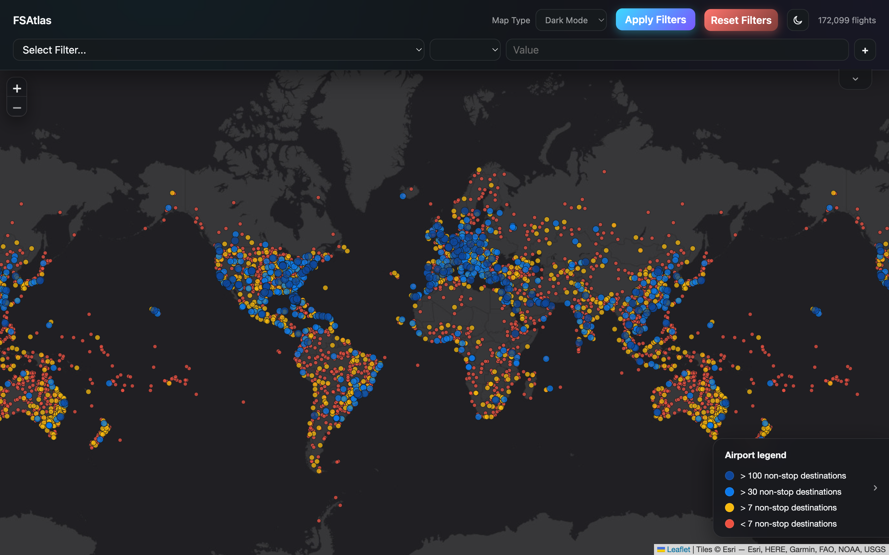
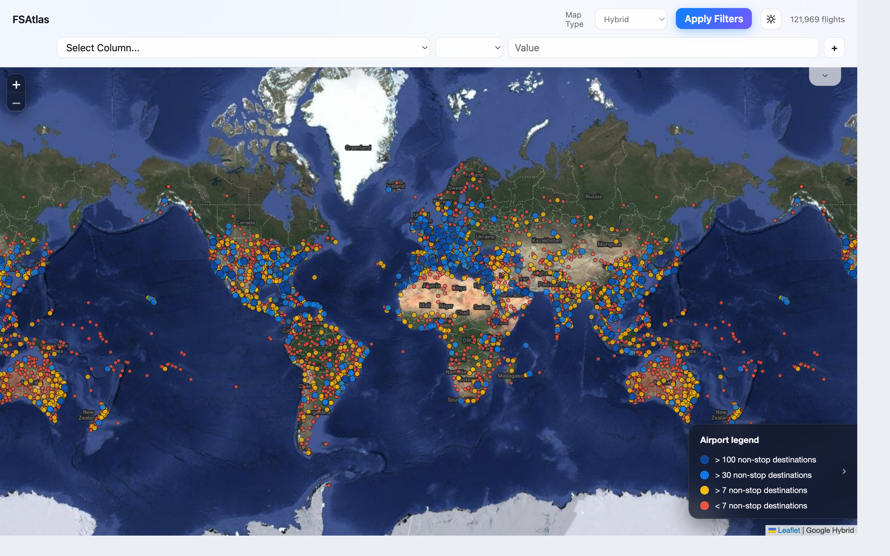
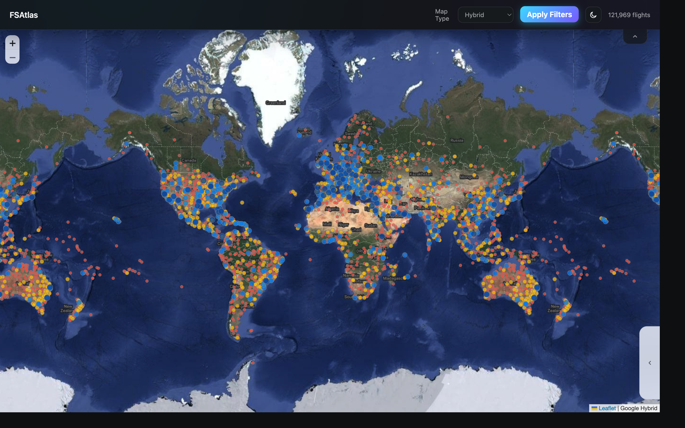

# FSAtlas

A lightweight, browser-based tool for visualising real-world flight data on an interactive world map, inspired by flightconnections.

---

## Screenshots

*Main view (dark mode)* — the full map with colour-coded airports, the filter bar, and the collapsible airport legend.



*Light mode* — the whole UI, including the map chrome, re-themes instantly via the light/dark toggle.



*Collapsible panels* — both the filter list and the airport legend tuck away into slim pull-tabs, keeping the map uncluttered.



---

## What Is It?

FSAtlas reads a CSV of flight records (built from live tracking data) and renders every departure/arrival airport as a colour-coded dot on an interactive Leaflet map. Click an airport to see every flight connected to it, then click a specific destination to drill into the individual flights on that route.

**Key features:**

- **Interactive world map** — every airport in the dataset is plotted on launch, colour-coded by how many non-stop destinations it serves
- **Click-to-explore** — click an airport to see its connections, click a connected airport to drill into that specific route, click again to back out
- **Detailed flight cards** — airline, aircraft type, registration, callsign, airport codes, and date for every flight on a route
- **Flexible column filtering** — build AND/OR filter chains over any column (airline, aircraft type, country, region, distance, flight time, timestamps, and more), with a live example value shown as you pick a column
- **Departure/Arrival Region** — countries are automatically grouped into regions (Africa, Asia, Europe, Oceania, North/Central/South America, Middle East) purely in memory, with no changes to the source data
- **Light/dark mode** — a single toggle re-themes the whole app, including the map, legend, and zoom controls, and remembers your preference
- **Multiple map styles** — Dark Mode / Light Mode (Esri, auto-selected with the theme toggle), Standard (OpenStreetMap), Satellite (Esri), and Hybrid (Google), switched instantly without needing to re-apply filters
- **Collapsible UI** — both the filter list and the airport legend hide away into small pull-tabs so they never get in the way of the map
- **Performance-minded** — airports render on canvas, routes are computed on demand per selection, and filtered map views are cached server-side per session

---

## Installation & Running

### 1. Clone the repository

```bash
git clone https://github.com/Leofric99/fsdispatch.git
cd fsdispatch
```

### 2. Install dependencies

It's recommended to use a virtual environment:

```bash
python3 -m venv .venv
source .venv/bin/activate   # on Windows: .venv\Scripts\activate
pip install -r requirements.txt
```

### 3. Run the application

```bash
python3 -m run
```

This starts a local web server and opens FSAtlas in your default browser. If it doesn't open automatically, the terminal will print the URL to open manually (e.g. `http://127.0.0.1:PORT`).

### 4. Import more flights (optional)

Merge additional flight records from a JSON file into `run/database/flights.csv`. The JSON must be a list of objects using the same field names as the CSV columns (e.g. `owner`, `reg`, `dep_airport_iata`, `timestamp_read`, etc). Duplicates (matched on registration, flight number, departure/arrival airport, and timestamp) are skipped automatically.

```bash
python3 -m run.import_flights path/to/new_flights.json
```

Add `--dry-run` to preview how many flights would be added/skipped without modifying the CSV.

> **Disclaimer:** This project was developed with the assistance of [GitHub Copilot](https://github.com/features/copilot). I am not a front-end developer, so there may well be bugs, rough edges, or unconventional code patterns. Contributions and bug reports are welcome!
