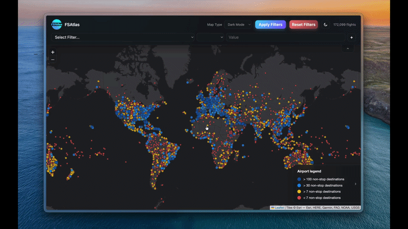
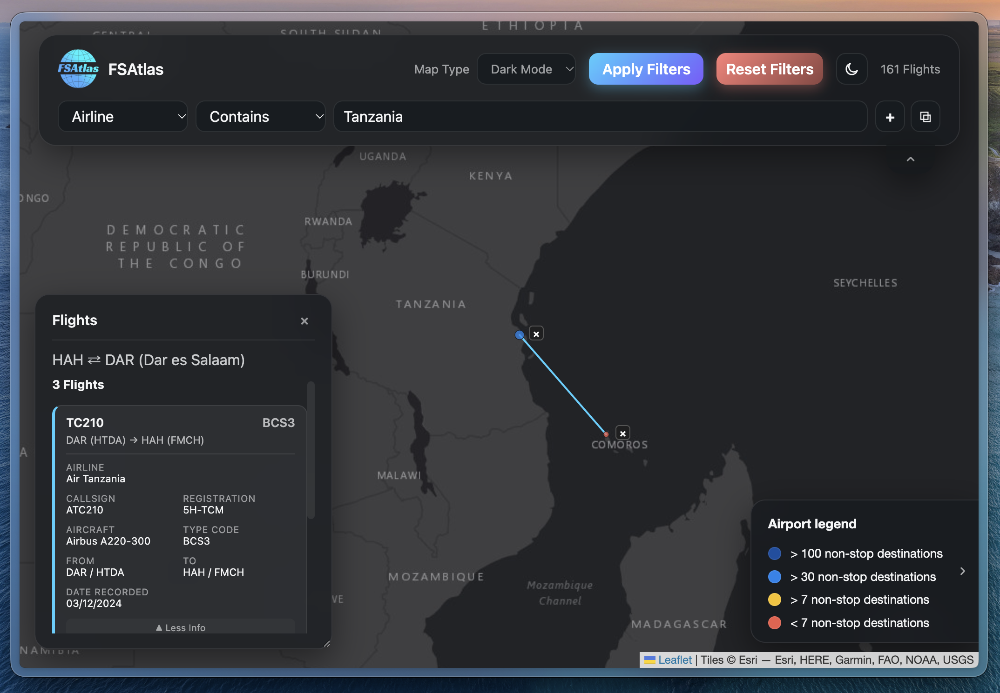
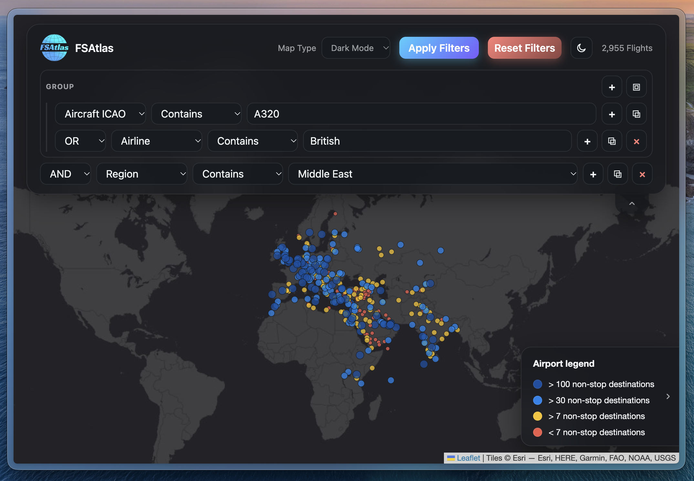
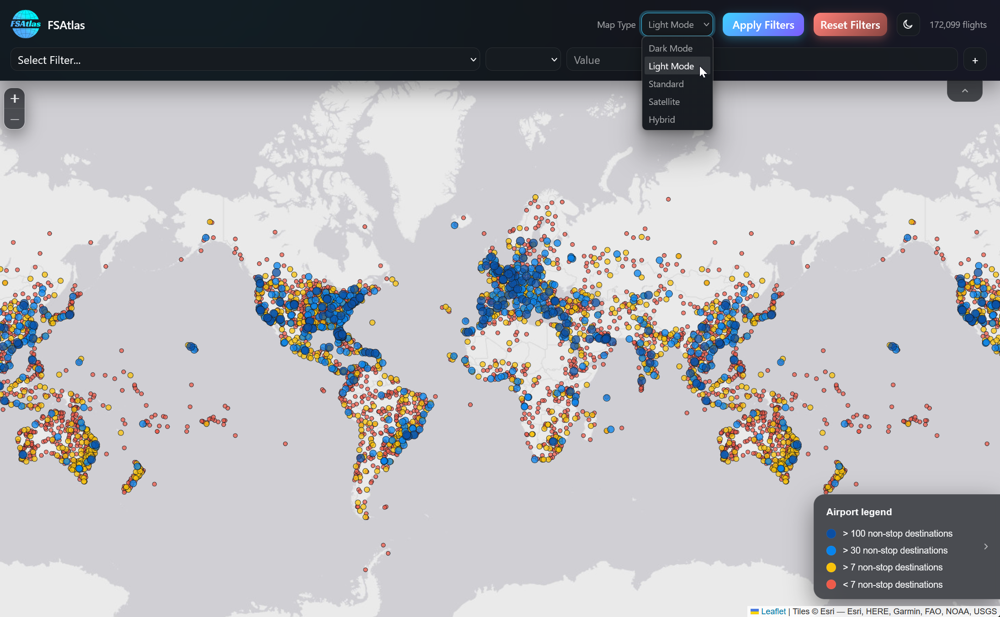

# FSAtlas

<p align="center">
  
</p>

<p align="center">
  Explore real-world flight data on an interactive world map.
</p>

<p align="center">
  <a href="#installation">Install</a> &nbsp;|&nbsp;
  <a href="#key-features">Features</a> &nbsp;|&nbsp;
  <a href="#docker">Docker</a>
</p>

---

## Demo


<p align="center">
  
</p>

---

## What Is It?

FSAtlas reads over 170,000 real-world flight records built from live tracking data and renders every departure and arrival airport as a colour-coded dot on an interactive map inspired by [flightconnections](www.flightconnections.com).

Click an airport to explore its connections, select a destination to inspect a route, and open individual flight details when you want to go deeper.

## Key Features

### Interactive World Map

The full dataset is plotted as soon as the app opens. Airports are rendered as colour-coded points, with the colour and scale of each point reflecting how many non-stop destinations it serves. This makes busy hubs easy to spot while keeping the wider network readable.

### Click-to-Explore Navigation

Start with the global map, select an airport to reveal its connections, then select a destination to drill into that route. The interface keeps the map visible while you move between the network view and route-level detail.

### Detailed Flight Information

Route results show the individual flights connecting the selected airports. Each flight includes the airline, aircraft type, registration, callsign, airport codes, and date when that information is available.

<p align="center">
  
</p>

### Flexible Filtering

Build filter chains across the available flight-data columns, including airline, aircraft type, country, region, distance, flight time, and timestamps. Filters can be combined with AND/OR logic, and the interface shows a real example value for the selected column to make queries easier to construct.

<p align="center">
  
</p>

### Departure and Arrival Regions

Countries are grouped into practical regions such as Africa, Asia, Europe, Oceania, North/Central/South America, and the Middle East. These groupings are calculated in memory, so the original flight data remains unchanged.

### Light and Dark Themes

Switch between light and dark themes from the interface. The selected theme updates the map, controls, legend, and surrounding UI, and your preference is remembered for the next visit.

### Multiple Map Styles

Choose between Dark Mode, Light Mode, Standard OpenStreetMap, Satellite, and Hybrid map styles. The light and dark Esri styles follow the selected theme, while the other options provide different ways to inspect the network.

<p align="center">
  
</p>

### Collapsible Interface Panels

Hide the filter list or airport legend when you need more room for the map. Both panels collapse into compact pull-tabs and can be restored without losing the current view or filters.

### Performance-Minded Rendering

Airports are rendered on canvas, routes are calculated only when requested, and filtered map views are cached server-side per session. This keeps the initial map responsive while avoiding unnecessary repeated work.

---

## Installation

Choose the setup that best fits your environment. The `uv` installation is the quickest way to run FSAtlas locally; Docker is useful when you want a repeatable, isolated service.

### Linux & MacOS

Install FSAtlas as a standalone command using [uv](https://docs.astral.sh/uv/).

#### Prerequisites

[**uv**](https://docs.astral.sh/uv/getting-started/installation/) — manages the isolated environment and makes the `fsatlas` command available on your `PATH`.

```bash
curl -LsSf https://astral.sh/uv/install.sh | sh
```

#### Installation

Install the latest version directly from the repository:

```bash
uv tool install git+https://github.com/Leofric99/fsatlas.git
```

Then run it:

```bash
fsatlas
```

This starts a local web server and opens FSAtlas in your default browser. If the browser does not open automatically, use the URL printed in the terminal, such as `http://127.0.0.1:PORT`.

For command-line options and help:

```bash
fsatlas -h
```

To upgrade to the latest version later, use:

```bash
uv tool upgrade fsatlas
```

### Windows

Download the standalone `.exe` from the [FSAtlas v2.0.0 release](https://github.com/Leofric99/fsatlas/releases/tag/v2.0.0).

Once it has downloaded, run the `.exe` and enjoy exploring with FSAtlas.

## Docker

Run FSAtlas in a container using [Docker](https://docs.docker.com/get-docker/). This is useful when you want to run it as a detached service or access it from another device on your network.

#### Prerequisites

[**Docker**](https://docs.docker.com/get-docker/) with Compose, included in Docker Desktop or available as the `docker-compose-plugin` package on Linux.

#### Build and run

From the project root, build the image and start the service in the background:

```bash
docker build -t fsatlas:latest .
docker compose up -d
```

The `-d` flag runs the container in the background, so it keeps running after you close the terminal. FSAtlas will be available at `http://<server_ip>:8000`.

To stop the service:

```bash
docker compose down
```

To rebuild after pulling updates:

```bash
docker build -t fsatlas:latest .
docker compose up -d
```

---

> **Disclaimer:** This project was developed with the assistance of [GitHub Copilot](https://github.com/features/copilot). I am not a front-end developer, so there may be bugs, rough edges, or unconventional code patterns. Contributions and bug reports are welcome!
