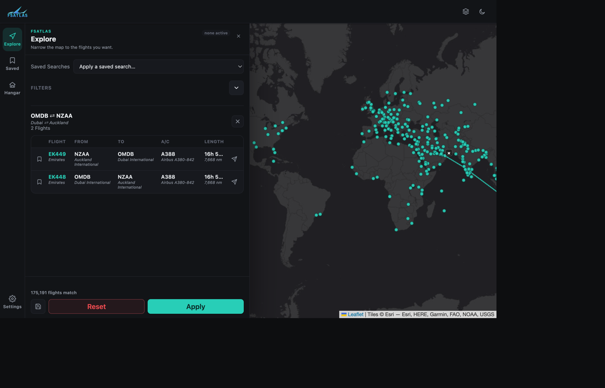

# Quickstart

Get FSAtlas running and explore your first route in under 5 minutes.

## 1. Get some flight data

FSAtlas needs a CSV of flight records at `run/database/flights.csv` before it has
anything to show. See [Flight Data Schema](../reference/flight-data-schema.md) for the
exact columns, or just grab the one-row example there to confirm everything works before
loading your real dataset.

## 2. Start the app

Pick one:

**Docker (fastest if you already have Docker installed):**

```bash
git clone https://github.com/Leofric99/fsatlas.git
cd fsatlas
# add run/database/flights.csv first
docker build -t fsatlas .
docker run -d --name fsatlas -p 8777:8000 fsatlas
```

Open **http://localhost:8777**.

**`uv` (fastest if you're on Linux/macOS without Docker):**

```bash
curl -LsSf https://astral.sh/uv/install.sh | sh
git clone https://github.com/Leofric99/fsatlas.git
cd fsatlas
# add run/database/flights.csv first
uv run fsatlas
```

This opens a browser window for you automatically.

Need Windows or more detail on either path? See the full
[Installation guide](installation.md).

## 3. Explore the map

Once the page loads, every airport in your dataset is already plotted:

1. **Click an airport dot** — every destination it serves lights up with route lines
   fanning out from it.
2. **Click one of those destination dots** — the pair narrows down to just that route,
   and a table of the individual flights appears in the Explore panel.
3. **Click a flight's bookmark icon** to save it, or the paper-plane icon to export it to
   [SimBrief](https://www.simbrief.com).
4. **Click the map elsewhere** (or the × badge on the selected airport) to back out and
   start again.



## 4. Narrow things down with a filter

Open the **Explore** panel (rail icon on the left) if it isn't already open, and try the
**Airline** category: pick an airline, hit **Apply**, and watch the map redraw to just
that carrier's network.

Full details on every filter category, grouping, and the saved-routes/saved-searches
panel are in [Basic Usage](../tutorials/basic-usage.md).

## What's next

- [Basic Usage](../tutorials/basic-usage.md) — the everyday workflow in more depth.
- [Advanced Features](../tutorials/advanced-features.md) — SimBrief export, the scenery
  overlay, and saved searches.
- [Configuration](../reference/configuration.md) — environment variables, ports, and
  where settings are stored.
