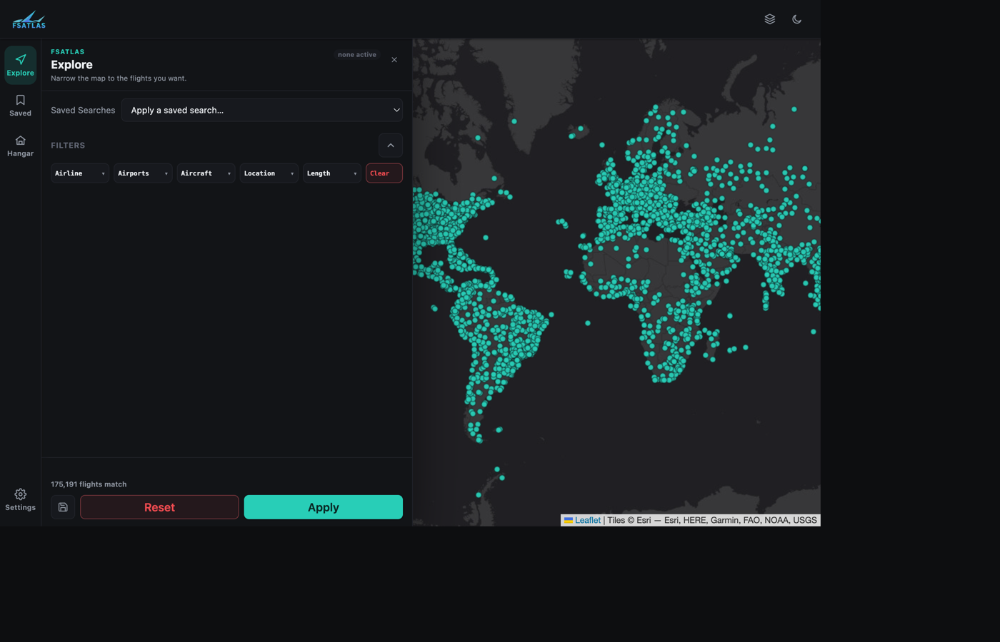

# FSAtlas

**Find inspiration for your next flight.** FSAtlas is a free, self-hosted, browser-based
tool for visualising real-world flight data on an interactive world map — similar to
[FlightConnections](https://www.flightconnections.com), but open-source and running
entirely on your own machine or server.

Load your own dataset of real-world flights (built from live tracking data, a personal
logbook export, or anything else you can shape into the expected CSV columns) and FSAtlas
plots every departure/arrival airport as a dot on the map. Click an airport to see its
routes, click a route to see the individual flights on it, and build nested AND/OR filters
to narrow the whole dataset down to exactly what you're looking for.

> FSAtlas is designed for finding **inspiration** for your next flight — it shows routes as
> a simple A → B. It is not a flight-planning tool and does not display waypoints, SIDs,
> STARs, or routings. [SimBrief](https://www.simbrief.com) (which FSAtlas integrates with
> directly, see [Advanced Features](tutorials/advanced-features.md)) is the right tool for that job.

## Where to start

- **I just want to run it** — head to the [Quickstart](getting-started/quickstart.md) for
  the fastest path to a running map (Docker or `uv`, in under 5 minutes).
- **I want the full setup guide** — the [Installation guide](getting-started/installation.md)
  covers every supported platform (Linux/macOS via `uv`, Docker, and the packaged Windows
  executable), plus how to persist your settings and bookmarks across restarts.
- **I want to learn the UI** — [Basic Usage](tutorials/basic-usage.md) walks through
  exploring the map, building filters, and saving routes/searches for later.

## Key features

- **Explore the whole network** — every airport in your dataset is plotted the moment the
  app opens, with marker colour reflecting destination count so busy hubs stand out.
- **Drill into routes and flights** — click an airport to fan out its routes, click a
  route to list the individual flights (airline, aircraft, registration, callsign, date).
- **Flexible nested filters** — combine airline, aircraft type, country, region, distance,
  and flight-time conditions with AND/OR logic and chip multi-select pickers.
- **Save routes & searches** — bookmark individual flights and whole filter combinations,
  then jump straight back to them later from the Saved panel.
- **SimBrief integration** — export a selected flight straight into a pre-filled SimBrief
  dispatch, no API key required.
- **Scenery overlay** — import your flight simulator's installed scenery folder (MSFS or
  X-Plane) and see which airports you already have scenery for, right on the map.
- **Four map styles, two themes** — Dark, Light, Standard (OpenStreetMap), Satellite, and
  Hybrid tiles, each available in dark or light chrome, remembered across visits.

## Project layout at a glance

FSAtlas is a small, single-maintainer, AI-assisted project (see the note at the bottom of
the [GitHub README](https://github.com/Leofric99/fsatlas)). It ships two ways to run it:

- **`python -m run` / the Docker image** — the actively-developed browser dashboard
  (rail + flyout panels) that every screenshot in this wiki shows, and the one these docs
  focus on.
- **`uv run fsatlas`** — the original desktop-style launcher (a system-tray icon on
  Windows, a classic toolbar-over-map layout), still what the packaged `fsatlas` command
  runs today while the two front-ends are mid-migration. It reads/writes the exact same
  `flights.csv` and settings files.

Both are covered in [Installation](getting-started/installation.md) so you can pick
whichever fits how you want to run it.

## Need help?

- Something not working? Check [Troubleshooting](reference/troubleshooting.md) first.
- Found a bug or have flight data to contribute? See [Contributing](community/contributing.md).
- Report issues on [GitHub Issues](https://github.com/Leofric99/fsatlas/issues).
