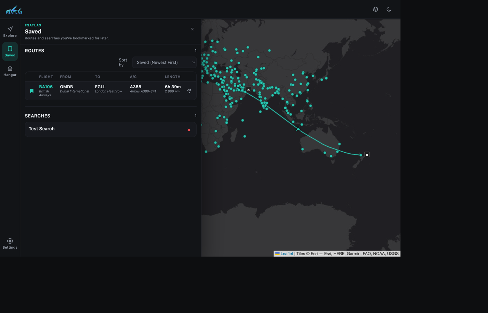

# Basic Usage

This page covers the everyday FSAtlas workflow: exploring the map, building filters, and
saving things for later. It assumes you already have the app open in your browser — see
[Quickstart](../getting-started/quickstart.md) if not.

## The layout

FSAtlas has three parts:

- **Top bar** — the FSAtlas logo, a map-style switcher, and a dark/light theme toggle.
- **Rail** (left edge on desktop, bottom tab bar on mobile) — four icons: **Explore**,
  **Saved**, **Hangar**, and **Settings**. Clicking one opens its panel; clicking the
  active one again closes it.
- **Map** — fills the rest of the screen and never scrolls away; every panel floats over
  it.

## Exploring the network

Every airport in your dataset is plotted as soon as the page loads, as a small dot. There
is no legend to decode — dots are purely for clicking.

1. **Click an airport dot.** Every route out of it fans out as a line across the map, and
   an × badge appears over the airport so you can back out again.
2. **Click one of the destination dots** that a route line leads to. The view narrows to
   just that A↔B pair, and a table of every individual flight on that route appears in
   the Explore panel below the filters.
3. **Click a column header** in that table (Flight / From / To / A/C / Length) to sort by
   it; click again to reverse the direction.
4. Click the **×** on the flight list's header, or the **×** badge on the destination
   airport, to go back to the full fan-out view. Click the source airport's own **×** (or
   click empty map space) to deselect entirely.

Panning and zooming works like any web map — FSAtlas renders extra "world copies" as you
scroll horizontally so you can follow a route across the antimeridian without it
disappearing off the edge.

## Filtering the map

Open the **Explore** panel (it's open by default on desktop). Underneath the **Saved
Searches** dropdown (more on that below) is the **Filters** section, with five
categories:

| Category    | What it matches                                                             |
|-------------|-------------------------------------------------------------------------------|
| Airline     | The operating airline.                                                        |
| Airports    | Departure or arrival airport, by ICAO, IATA, or full name.                     |
| Aircraft    | Aircraft type, by ICAO code or full type name.                                |
| Location    | Departure or arrival city, country, or region.                                |
| Length      | A distance (nautical miles) or flight-time (hours) range, via two sliders.    |

Airline/Airports/Aircraft/Location are **chip multi-select** fields: click the category,
type to search, and click as many matching values as you like — they're combined with
"is any of" logic within that one category. Click the category's badge again to see/edit
your current selection, or use the **is / is not** toggle inside it to invert the match.

Once you're happy with your conditions, click **Apply** to redraw the map. The small text
above the Apply/Reset buttons gives you a live, debounced **preview** of how many flights
would match as you edit — the bold count below it only updates once you actually apply.

- **Clear** (inside the Filters section) resets every category back to empty without
  reapplying — click **Apply** afterwards to actually show the unfiltered map again, or
  use **Reset** (next to Apply) to clear *and* re-apply in one click.
- Click the **Filters** heading's chevron to collapse the whole category row out of the
  way once you've got the conditions you want — handy on a small screen, and it collapses
  itself automatically on mobile right after you hit Apply.

## Saved Searches

The **Saved Searches** dropdown at the top of the Explore panel lets you jump straight
back to a previously-saved filter combination without opening the Saved panel. To create
one in the first place: build your filters, then click the floppy-disk icon next to
Reset/Apply, give it a short description, and confirm. It'll then show up in both this
dropdown and the Saved panel's **Searches** section.

## Saving flights

Every flight row — whether in a route's flight table or the Saved panel's own list — has
a bookmark icon on its left edge. Click it to save that flight for later; click it again
to remove it. The paper-plane icon next to it exports that flight to SimBrief (see
[Advanced Features](advanced-features.md#simbrief-export)).

## The Saved panel

Two sections, always both visible:

- **Routes** — every flight you've bookmarked, as a sortable table (click a column header,
  or use the **Sort by** dropdown for Saved date / Distance instead). Clicking a row jumps
  straight to that route on the map, with its details highlighted in the flight table.
- **Searches** — every saved filter combination, by description. Click one to apply it
  immediately; click its **×** to delete it.

## Choosing a map style and theme

The top bar's layered-squares icon opens a popover with five tile styles (Dark Mode,
Light Mode, Standard, Satellite, Hybrid) plus — if you've imported scenery, see
[Advanced Features](advanced-features.md#scenery-overlay) — a **Scenery Overlay** toggle.
The moon/sun icon next to it swaps the whole UI (not just the map tiles) between dark and
light chrome. Both choices are remembered for your next visit.

## Next up

[Advanced Features](advanced-features.md) covers SimBrief export, the scenery overlay,
and nested/combined filters in more depth.
